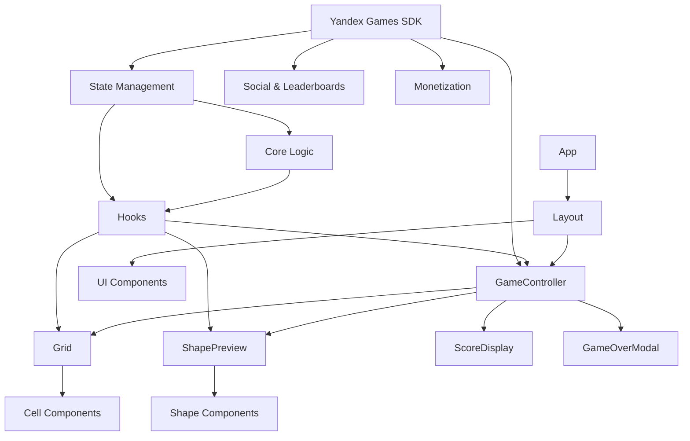
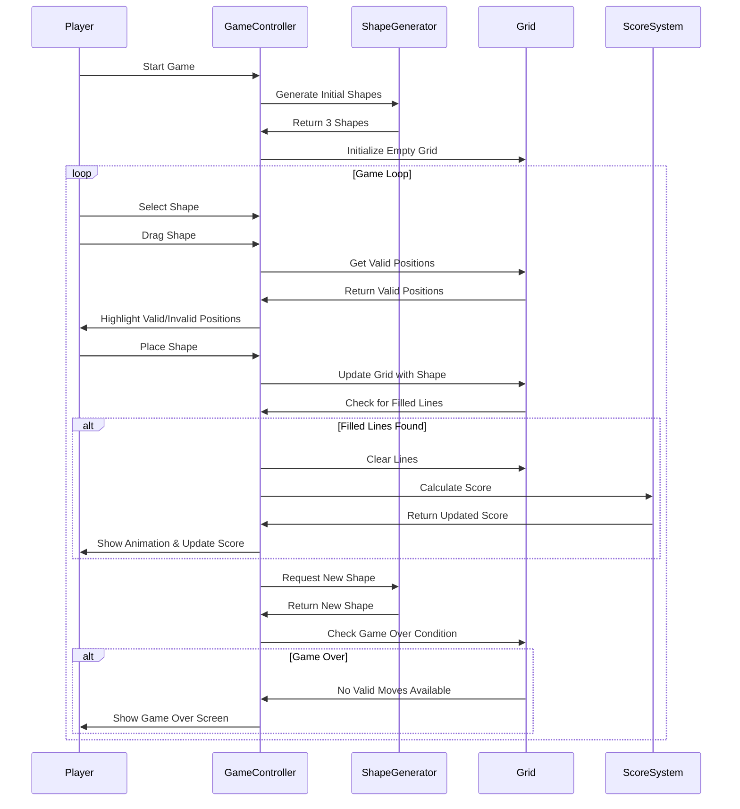

# План разработки игры "Тетрис-блоки" на React

## Детальный план разработки

### Этап 1: Настройка проекта и базовая структура

1. **Инициализация проекта:**
   - Создание проекта с использованием Create React App или Vite с шаблоном TypeScript
   - Настройка ESLint и Prettier для обеспечения качества кода
   - Настройка структуры директорий согласно ТЗ

2. **Настройка управления состоянием:**
   - Выбор и настройка библиотеки для управления состоянием (либо встроенные хуки React, либо zustand)
   - Определение структуры глобального состояния игры
   - Создание базовых редьюсеров/хуков для управления состоянием

3. **Настройка маршрутизации (если необходимо):**
   - Настройка навигации между экранами (главный экран, игра, настройки, туториал)

### Этап 2: Реализация ядра игровой логики

1. **Реализация моделей данных:**
   - Определение типов и интерфейсов для игровой сетки, блоков, фигур
   - Реализация генератора фигур и их ориентаций

2. **Разработка базовой игровой логики:**
   - Функции для проверки возможности размещения фигуры
   - Логика размещения фигуры на игровой сетке
   - Проверка заполненных строк и столбцов
   - Система подсчета очков и комбо

3. **Создание пользовательских хуков:**
   - useGameState для управления игровым состоянием
   - useShapes для генерации и управления фигурами
   - useScore для подсчета и отслеживания очков

### Этап 3: Разработка пользовательского интерфейса

1. **Реализация базовых компонентов UI:**
   - Компоненты кнопок, модальных окон, лейблов
   - Создание общего макета приложения (Layout)

2. **Разработка игровых компонентов:**
   - Компонент Grid для отображения игровой сетки
   - Компонент Shape для отображения фигур
   - Компонент Preview для предпросмотра доступных фигур
   - Компонент Score для отображения счета и комбо

3. **Реализация drag-and-drop механики:**
   - Настройка библиотеки для drag-and-drop
   - Реализация логики перемещения фигур
   - Добавление визуальных индикаторов ("призрак" фигуры)

### Этап 4: Визуальный дизайн и анимации

1. **Разработка визуального стиля:**
   - Определение цветовой схемы и визуальных элементов
   - Стилизация игровых компонентов
   - Стилизация UI элементов

2. **Реализация анимаций:**
   - Анимации появления и исчезновения блоков
   - Анимации очистки линий
   - Анимации перемещения фигур
   - Визуальные эффекты для набора очков

3. **Адаптивный дизайн:**
   - Оптимизация интерфейса для различных размеров экрана
   - Различные макеты для мобильных и десктопных устройств
   - Поддержка различных ориентаций устройства

### Этап 5: Режим обучения (туториал)

1. **Разработка структуры туториала:**
   - Создание компонентов для отображения шагов туториала
   - Реализация логики переходов между шагами

2. **Реализация содержания туториала:**
   - Создание контента для каждого шага
   - Реализация интерактивных элементов
   - Добавление визуальных подсказок

### Этап 6: Расширенные функции

1. **Система достижений и наград:**
   - Реализация логики отслеживания достижений
   - Создание интерфейса для просмотра достижений
   - Реализация системы наград

2. **Локализация:**
   - Настройка библиотеки i18next
   - Создание файлов локализации для трех языков
   - Реализация переключения языков

### Этап 7: Интеграция с Яндекс Играми

1. **Настройка SDK и базовая интеграция:**
   - Подключение SDK Яндекс Игр
   - Реализация авторизации и работы с профилями

2. **Интеграция социальных функций:**
   - Настройка таблицы лидеров
   - Реализация шаринга результатов
   - Настройка облачных сохранений

3. **Реализация монетизации:**
   - Интеграция рекламы
   - Настройка внутриигровых покупок

### Этап 8: Тестирование и оптимизация

1. **Модульное и интеграционное тестирование:**
   - Тестирование игровой логики
   - Тестирование компонентов UI
   - Тестирование взаимодействия компонентов

2. **Оптимизация производительности:**
   - Профилирование и выявление узких мест
   - Оптимизация ререндеров компонентов
   - Оптимизация анимаций

3. **Пользовательское тестирование:**
   - Сбор обратной связи от тестировщиков
   - Внесение корректировок на основе обратной связи

### Этап 9: Публикация

1. **Подготовка к публикации:**
   - Сборка финальной версии
   - Тестирование на различных устройствах
   - Подготовка описания и медиаматериалов

2. **Публикация на платформе Яндекс Игры:**
   - Загрузка игры на платформу
   - Настройка параметров публикации
   - Мониторинг после запуска

## Диаграмма компонентов проекта

## Диаграмма потока игрового процесса

## График разработки

| Этап | Описание | Ориентировочная продолжительность |
|------|----------|-----------------------------------|
| 1    | Настройка проекта и базовая структура | 2-3 дня |
| 2    | Реализация ядра игровой логики | 5-7 дней |
| 3    | Разработка пользовательского интерфейса | 7-10 дней |
| 4    | Визуальный дизайн и анимации | 5-7 дней |
| 5    | Режим обучения (туториал) | 3-5 дней |
| 6    | Расширенные функции | 5-7 дней |
| 7    | Интеграция с Яндекс Играми | 4-6 дней |
| 8    | Тестирование и оптимизация | 5-7 дней |
| 9    | Публикация | 2-3 дня |

**Общая продолжительность проекта:** 38-55 дней