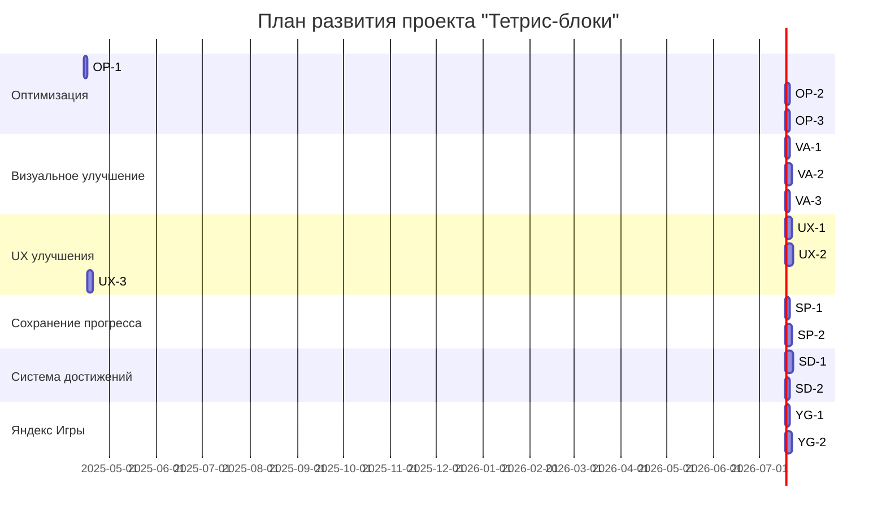

# План дальнейшего развития игры "Тетрис-блоки"

## Текущий статус проекта (на 14.04.2025)

Проект "Тетрис-блоки" находится на этапе завершения базовой функциональности и перехода к расширенным возможностям. Основные компоненты и игровая механика уже реализованы, проведен рефакторинг кода для улучшения поддерживаемости и производительности.

### Выполнено:
- Создана базовая структура проекта с использованием React 19, TypeScript и Vite
- Реализована основная игровая логика через core-модули
- Разработаны пользовательские хуки для управления состоянием игры
- Созданы основные компоненты интерфейса и экраны
- Настроена адаптивность для мобильных и десктопных устройств
- Реализована механика drag-and-drop для размещения фигур
- Завершен рефакторинг GameController с разделением на MobileGameLayout и DesktopGameLayout
- Оптимизирован механизм перемещения фигур с использованием transform
- Подготовлена локализация для трех языков

## Задачи на ближайшее время (2-4 недели)

Ниже представлен детальный список задач, разбитый по категориям. Каждая задача содержит описание, технические требования и критерии приемки.

### Категория: Оптимизация производительности

#### Задача OP-1: Профилирование и выявление узких мест в производительности

**Описание:**  
Провести профилирование приложения для выявления узких мест в производительности, особенно на мобильных устройствах и при анимациях очистки линий.

**Технические требования:**
- Использовать React Profiler и Chrome DevTools для анализа производительности
- Проанализировать время рендеринга ключевых компонентов (Grid, Shape, GameController)
- Выявить возможные причины лагов при перемещении фигур и очистке линий
- Проанализировать использование памяти и CPU

**Критерии приемки:**
- Составлен отчет с выявленными узкими местами в производительности
- Предложены конкретные решения для улучшения производительности
- Определены метрики для отслеживания прогресса оптимизации

**Ожидаемое время выполнения:** 1-2 дня

---

#### Задача OP-2: Оптимизация ререндеров компонентов

**Описание:**  
Оптимизировать ререндеры компонентов с использованием React.memo, useMemo и useCallback для снижения количества ненужных рендеров.

**Технические требования:**
- Использовать React.memo для компонентов, которые часто ререндерятся без изменения пропсов
- Применить useMemo для дорогостоящих вычислений в компонентах
- Использовать useCallback для функций, передаваемых дочерним компонентам
- Особое внимание уделить компонентам Grid, Shape и их дочерним элементам

**Критерии приемки:**
- Снижено количество ререндеров ключевых компонентов на 30% (измерять с помощью React Profiler)
- Улучшена плавность анимаций на мобильных устройствах
- Поддерживается стабильный FPS (60 кадров в секунду) во время игры

**Ожидаемое время выполнения:** 2-3 дня

---

#### Задача OP-3: Улучшение алгоритма проверки и очистки линий

**Описание:**  
Оптимизировать алгоритм проверки заполненных линий и их очистки для улучшения производительности на мобильных устройствах.

**Технические требования:**
- Пересмотреть алгоритм проверки заполненных строк и столбцов в gameLogic.ts
- Избегать избыточных вычислений и повторных проходов по массиву
- Оптимизировать структуры данных для более эффективной проверки
- Разделить логику проверки и анимации очистки линий

**Критерии приемки:**
- Улучшено время выполнения алгоритма проверки линий на 30%
- Устранены задержки при одновременной очистке нескольких линий
- Код читаем, поддерживается типизация и сохраняется логика игры

**Ожидаемое время выполнения:** 2-3 дня

---

### Категория: Визуальная обратная связь и анимации

#### Задача VA-1: Улучшение анимаций размещения фигур

**Описание:**  
Добавить плавные анимации для размещения фигур на игровом поле, обеспечивающие визуальную обратную связь для игрока.

**Технические требования:**
- Использовать CSS-анимации или анимационную библиотеку (например, Framer Motion)
- Реализовать эффект "падения" фигуры в сетку при размещении
- Добавить визуальный эффект при фиксации фигуры на игровом поле
- Обеспечить плавность анимаций на мобильных устройствах

**Критерии приемки:**
- Реализованы плавные и отзывчивые анимации размещения фигур
- Анимации не замедляют игровой процесс
- Анимации адаптивны на различных размерах экрана
- Соблюдается визуальная согласованность стиля

**Ожидаемое время выполнения:** 2-3 дня

---

#### Задача VA-2: Создание анимаций для очистки линий

**Описание:**  
Разработать визуально привлекательные анимации для очистки заполненных линий на игровом поле.

**Технические требования:**
- Реализовать последовательность анимаций: подсветка линий, исчезновение, сдвиг оставшихся блоков
- Добавить частицы или визуальные эффекты при очистке линий
- Анимация должна масштабироваться в зависимости от количества очищаемых линий
- Добавить визуальное и звуковое усиление при очистке нескольких линий одновременно

**Критерии приемки:**
- Реализованы привлекательные анимации очистки линий
- Анимации масштабируются в зависимости от количества очищаемых линий
- Обеспечена производительность 60 FPS даже при очистке нескольких линий
- Анимации не мешают игровому процессу

**Ожидаемое время выполнения:** 3-4 дня

---

#### Задача VA-3: Добавление анимаций для начисления очков

**Описание:**  
Разработать и реализовать анимации для отображения начисления очков при очистке линий.

**Технические требования:**
- Создать "всплывающие" числа, показывающие количество набранных очков
- Анимировать изменение счета в интерфейсе
- Реализовать специальные эффекты для комбо и больших очков
- Обеспечить корректное отображение на разных размерах экрана

**Критерии приемки:**
- Очки анимированно "всплывают" при начислении
- Реализованы особые эффекты для комбо и больших очков
- Эффекты не мешают игровому процессу
- Обеспечена адаптивность на различных устройствах

**Ожидаемое время выполнения:** 2-3 дня

---

### Категория: Улучшение пользовательского опыта

#### Задача UX-1: Добавление звуковых эффектов

**Описание:**  
Реализовать систему звуковых эффектов для основных игровых действий и событий.

**Технические требования:**
- Добавить звуковые эффекты для следующих действий:
  * Размещение фигуры на поле
  * Очистка линий (разные звуки для разного количества линий)
  * Получение комбо
  * Конец игры
- Реализовать простой механизм управления звуком (вкл/выкл)
- Оптимизировать загрузку звуков для уменьшения задержек
- Использовать веб-аудио API или библиотеку для работы со звуком

**Критерии приемки:**
- Звуковые эффекты соответствуют игровым действиям и улучшают опыт пользователя
- Звуки воспроизводятся без заметных задержек
- Реализован механизм отключения звука
- Звуки не вызывают проблем с производительностью

**Ожидаемое время выполнения:** 3-4 дня

---

#### Задача UX-2: Расширение обучающего режима (туториала)

**Описание:**  
Доработать существующий обучающий режим, добавив пошаговые инструкции и интерактивные элементы.

**Технические требования:**
- Разделить туториал на логические шаги с четкими инструкциями
- Добавить визуальные подсказки (стрелки, выделение элементов)
- Реализовать контроль выполнения каждого шага перед переходом к следующему
- Обеспечить возможность пропуска туториала или возврата к определенным шагам

**Критерии приемки:**
- Обучающий режим понятно объясняет основные механики игры
- Визуальные подсказки ясно указывают на нужные действия
- Пользователь может пропустить туториал или вернуться к нему
- Туториал адаптирован для различных размеров экрана

**Ожидаемое время выполнения:** 4-5 дней

---

#### Задача UX-3: Улучшение визуального стиля блоков и фигур

**Описание:**  
Улучшить визуальный стиль блоков и фигур, добавив 3D-эффекты, тени и блики.

**Технические требования:**
- Добавить 3D-эффекты для блоков с использованием CSS или SVG
- Реализовать тени и блики для создания объемного вида
- Обеспечить единый визуальный стиль для всех фигур
- Оптимизировать стили для корректного отображения на различных устройствах

**Критерии приемки:**
- Блоки и фигуры имеют привлекательный 3D-вид
- Стиль согласован во всем приложении
- Эффекты не влияют негативно на производительность
- Визуальный стиль соответствует общей эстетике игры

**Ожидаемое время выполнения:** 3-4 дня

---

### Категория: Сохранение прогресса и данных

#### Задача SP-1: Реализация сохранения рекордов в localStorage

**Описание:**  
Добавить функциональность сохранения рекордов игрока в localStorage браузера.

**Технические требования:**
- Реализовать сохранение лучших результатов игрока в localStorage
- Создать интерфейс для отображения таблицы рекордов
- Добавить сохранение имени игрока (опционально)
- Обеспечить сортировку и отображение ТОП-10 результатов

**Критерии приемки:**
- Рекорды сохраняются между сессиями
- Интерфейс таблицы рекордов понятен и привлекателен
- Реализовано корректное добавление новых рекордов и их сортировка
- Обеспечена защита от манипуляций с данными

**Ожидаемое время выполнения:** 2-3 дня

---

#### Задача SP-2: Добавление возможности сохранения и продолжения игры

**Описание:**  
Реализовать функциональность сохранения текущего состояния игры и возможность продолжения игры после закрытия браузера.

**Технические требования:**
- Сохранять состояние игрового поля, текущий счет и доступные фигуры
- Реализовать автоматическое сохранение при закрытии вкладки/браузера
- Добавить кнопку "Продолжить" на главном экране (если есть сохраненная игра)
- Учесть совместимость с разными браузерами и устройствами

**Критерии приемки:**
- Состояние игры корректно сохраняется и восстанавливается
- На главном экране отображается кнопка "Продолжить" при наличии сохраненной игры
- Работает автоматическое сохранение при закрытии
- Реализована обработка возможных ошибок при сохранении/загрузке

**Ожидаемое время выполнения:** 3-4 дня

---

### Категория: Система достижений

#### Задача SD-1: Создание базовой системы достижений

**Описание:**  
Разработать и реализовать базовую систему отслеживания достижений игрока.

**Технические требования:**
- Определить набор достижений (минимум 10 различных достижений)
- Реализовать механизм отслеживания прогресса для каждого достижения
- Создать хранилище для статуса достижений в localStorage
- Разработать компоненты для отображения списка достижений

**Критерии приемки:**
- Система корректно отслеживает и обновляет прогресс достижений
- Достижения сохраняются между сессиями
- Интерфейс достижений информативен и привлекателен
- Достижения разнообразны и стимулируют различные стили игры

**Ожидаемое время выполнения:** 4-5 дней

---

#### Задача SD-2: Реализация уведомлений о получении достижений

**Описание:**  
Добавить систему уведомлений, которая будет информировать игрока о разблокировке новых достижений.

**Технические требования:**
- Разработать компонент всплывающего уведомления о новом достижении
- Реализовать анимацию появления и исчезновения уведомления
- Добавить звуковое сопровождение для уведомлений
- Обеспечить нескучный дизайн уведомлений, не мешающий игровому процессу

**Критерии приемки:**
- Уведомления появляются при разблокировке достижений
- Анимации плавные и не влияют на производительность
- Звуковое сопровождение уместно и не раздражает
- Уведомления не мешают игровому процессу

**Ожидаемое время выполнения:** 2-3 дня

---

### Категория: Подготовка к интеграции с Яндекс Играми

#### Задача YG-1: Исследование требований и документации Яндекс Игр

**Описание:**  
Изучить документацию и требования для интеграции игры с платформой Яндекс Игры.

**Технические требования:**
- Ознакомиться с документацией SDK Яндекс Игр
- Изучить требования к размеру и формату файлов игры
- Проанализировать API для сохранения прогресса, таблицы лидеров и рекламы
- Составить список необходимых изменений для интеграции

**Критерии приемки:**
- Составлен детальный отчет о требованиях и процессе интеграции
- Определен список изменений, необходимых для интеграции
- Выявлены потенциальные проблемы и ограничения
- Создан план интеграции с временными оценками

**Ожидаемое время выполнения:** 2-3 дня

---

#### Задача YG-2: Подготовка структуры для интеграции с Яндекс Играми

**Описание:**  
Подготовить архитектуру приложения для будущей интеграции с SDK Яндекс Игр.

**Технические требования:**
- Создать модуль-заглушку для SDK Яндекс Игр
- Разработать интерфейсы для работы с API Яндекс Игр
- Подготовить абстракции для таблицы лидеров, сохранений и рекламы
- Обеспечить возможность запуска игры как с SDK, так и без него (для локальной разработки)

**Критерии приемки:**
- Созданы необходимые модули и интерфейсы для интеграции
- Архитектура допускает запуск в разных режимах (с SDK и без)
- Подготовлены заглушки для основных функций SDK
- Код модульный и легко расширяемый

**Ожидаемое время выполнения:** 3-4 дня

---

## Диаграмма ближайших шагов

## Приоритеты задач

### Высокий приоритет:
1. OP-1: Профилирование и выявление узких мест в производительности
2. OP-2: Оптимизация ререндеров компонентов
3. VA-1: Улучшение анимаций размещения фигур
4. VA-2: Создание анимаций для очистки линий

### Средний приоритет:
1. OP-3: Улучшение алгоритма проверки и очистки линий
2. VA-3: Добавление анимаций для начисления очков
3. UX-1: Добавление звуковых эффектов
4. SP-1: Реализация сохранения рекордов в localStorage

### Низкий приоритет:
1. UX-2: Расширение обучающего режима (туториала)
2. UX-3: Улучшение визуального стиля блоков и фигур
3. SP-2: Добавление возможности сохранения и продолжения игры
4. SD-1: Создание базовой системы достижений
5. SD-2: Реализация уведомлений о получении достижений
6. YG-1: Исследование требований и документации Яндекс Игр
7. YG-2: Подготовка структуры для интеграции с Яндекс Играми

## Ожидаемые результаты

После выполнения всех задач из данного плана проект "Тетрис-блоки" должен достичь следующих результатов:

1. Повышенная производительность и оптимизация для различных устройств
2. Улучшенный визуальный стиль с анимациями и звуковыми эффектами
3. Расширенный пользовательский опыт с системой достижений и сохранением прогресса
4. Подготовка для будущей интеграции с платформой Яндекс Игры

Проект будет готов к третьему этапу разработки, который включает интеграцию с Яндекс Играми и расширение функциональности для монетизации.