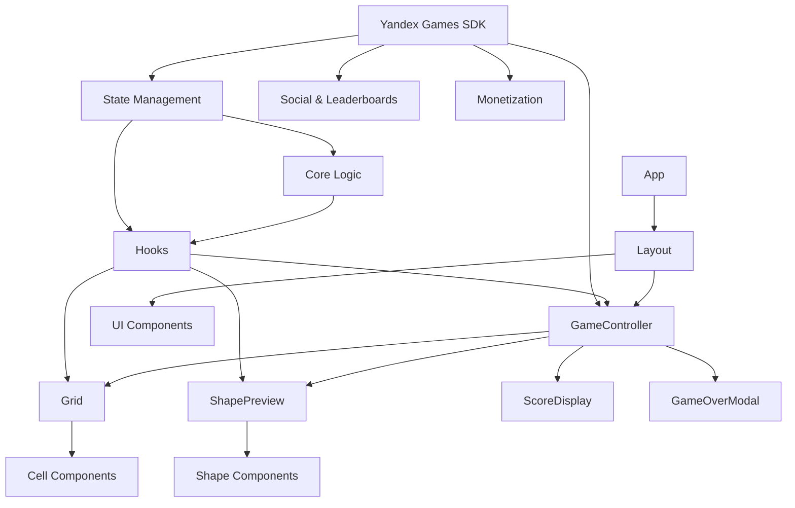
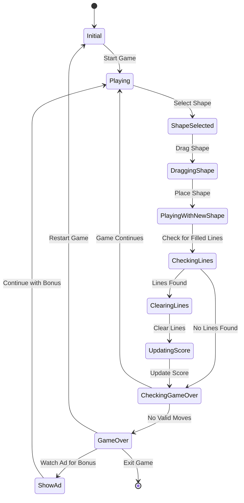

# Техническое задание на разработку игры "Тетрис-блоки" на чистом React

## 1. Общее описание проекта

### 1.1. Название проекта
"Тетрис-блоки"

### 1.2. Концепция
Игра-головоломка, в которой игроки размещают различные фигуры (подобные фигурам из тетриса) на игровой сетке 8x8. Цель игры - очищать заполненные строки и столбцы, набирая при этом очки. Игра должна иметь яркий визуальный стиль, характерный для популярных казуальных игр.

### 1.3. Целевая аудитория
- Любители казуальных игр и головоломок
- Все возрастные группы
- Пользователи как мобильных устройств, так и ПК

### 1.4. Платформы
- Веб-браузеры (десктоп и мобильные)
- Публикация на платформе Яндекс Игры
- Адаптивный дизайн для различных размеров экрана

## 2. Требования к технологиям

### 2.1. Основные технологии
- React для пользовательского интерфейса и управления состоянием
- TypeScript для статической типизации
- CSS/SCSS для стилей
- SDK Яндекс Игр для интеграции с платформой

### 2.2. Рекомендуемые библиотеки
- React Hooks для управления состоянием
- Styled Components или CSS Modules для стилизации компонентов
- Framer Motion или React Spring для анимаций
- React DnD или react-draggable для реализации drag-and-drop функциональности
- react-responsive для адаптивного дизайна
- zustand или Redux Toolkit для управления глобальным состоянием (опционально)
- i18next для локализации

### 2.3. Инструменты сборки
- Create React App или Vite для начальной конфигурации проекта
- ESLint и Prettier для обеспечения качества кода

## 3. Архитектура приложения

### 3.1. Структура проекта
```
/
├── public/                  # Статические файлы
├── src/                     # Исходный код
│   ├── components/          # React компоненты
│   │   ├── game/            # Игровые компоненты
│   │   │   ├── Grid.tsx     # Компонент игровой сетки
│   │   │   ├── Shape.tsx    # Компонент фигуры
│   │   │   ├── Preview.tsx  # Компонент предпросмотра фигур
│   │   │   └── Score.tsx    # Компонент отображения счета
│   │   ├── ui/              # UI компоненты
│   │   │   ├── Button.tsx   # Компонент кнопки
│   │   │   ├── Modal.tsx    # Компонент модального окна
│   │   │   └── Layout.tsx   # Компонент для макета приложения
│   │   └── shared/          # Общие компоненты
│   ├── hooks/               # Пользовательские хуки
│   │   ├── useGameState.ts  # Хук для управления состоянием игры
│   │   ├── useShapes.ts     # Хук для генерации и управления фигурами
│   │   └── useScore.ts      # Хук для подсчета очков
│   ├── core/                # Ядро игровой логики
│   │   ├── gameLogic.ts     # Логика размещения фигур и очистки линий
│   │   ├── scoreSystem.ts   # Система подсчета очков
│   │   └── shapeGenerator.ts # Генерация фигур
│   ├── types/               # Определения типов
│   │   ├── game.ts          # Типы, связанные с игрой
│   │   └── shapes.ts        # Типы фигур
│   ├── constants/           # Константы и конфигурации
│   │   ├── gameConfig.ts    # Конфигурация игры
│   │   └── colors.ts        # Цветовая схема
│   ├── utils/               # Утилитарные функции
│   │   ├── stateUtils.ts    # Утилиты для иммутабельной работы с состоянием
│   │   └── animations.ts    # Утилиты для анимаций
│   ├── assets/              # Медиа-ресурсы (изображения, звуки)
│   ├── contexts/            # React контексты (опционально)
│   ├── localization/        # Файлы локализации
│   │   ├── ru.json          # Русский язык
│   │   ├── en.json          # Английский язык
│   │   └── tr.json          # Турецкий язык
│   ├── integration/         # Интеграция с внешними сервисами
│   │   └── yandex/          # Интеграция с Яндекс Играми
│   ├── analytics/           # Аналитика
│   ├── App.tsx              # Корневой компонент
│   └── index.tsx            # Точка входа
```

### 3.2. Архитектурные паттерны
- Компонентная архитектура React с функциональными компонентами и хуками
- Иммутабельное управление состоянием
- Разделение ответственности между компонентами по принципу единой ответственности
- Фасадный паттерн для игровой логики

### 3.3. Управление состоянием
- Локальное состояние компонентов с использованием useState
- Глобальное состояние игры через хук useGameState (или Context API, zustand, Redux)
- Иммутабельный подход к обновлению состояния

## 4. Игровая механика

### 4.1. Игровое поле
- Сетка размером 8x8 ячеек
- Каждая ячейка может быть пустой или заполненной (с определенным цветом)

### 4.2. Фигуры
- 8 типов фигур:
  * SINGLE: одиночный блок
  * LINE_2: линия из 2 блоков
  * LINE_3: линия из 3 блоков
  * L_SHAPE: Г-образная фигура
  * SQUARE: квадрат из 4 блоков
  * T_SHAPE: Т-образная фигура
  * CROSS: крестообразная фигура
  * Z_SHAPE: Z-образная фигура
- Каждая фигура должна иметь случайный цвет из предопределенного набора ярких цветов
- Фигуры должны генерироваться с разными ориентациями (повороты на 0°, 90°, 180°, 270°)

### 4.3. Игровой процесс
- Игрок всегда имеет 3 фигуры на выбор
- Игрок может выбрать фигуру и разместить ее на сетке с помощью drag-and-drop
- При перемещении фигуры над сеткой должен отображаться "призрак" фигуры, показывающий, где она будет размещена
- "Призрак" должен изменять цвет в зависимости от возможности размещения (зеленый - можно, красный - нельзя)
- После размещения фигуры, она заменяется новой

### 4.4. Очистка линий
- Когда строка или столбец полностью заполнены, они очищаются
- За очистку начисляются очки
- При перемещении фигуры над сеткой должны подсвечиваться линии, которые будут очищены
- Очищенные ячейки исчезают с анимацией

### 4.5. Система очков
- За каждую очищенную ячейку игрок получает 10 базовых очков
- Если очищено несколько линий одновременно (и строки, и столбцы), применяется множитель 1.5
- При последовательной очистке линий без пропусков активируется множитель комбо (формула: 1 + (комбо * 0.1))
- Общие очки = базовые_очки * бонус_за_область * бонус_за_комбо
- При получении очков их значение должно анимированно появляться над игровым полем

### 4.6. Окончание игры
- Игра заканчивается, когда на поле невозможно разместить ни одну из доступных фигур
- При окончании игры показывается модальное окно с итоговым счетом и кнопкой "Заново"
- Игрок может получить бонусные фигуры за просмотр рекламы через Яндекс.SDK

## 5. Визуальный дизайн и UI

### 5.1. Общий стиль
- Яркие, насыщенные цвета
- Современный минималистичный дизайн
- Плавные анимации и переходы
- Визуальные эффекты для важных игровых событий (очистка линий, окончание игры)

### 5.2. Игровая сетка
- Чёткие визуальные границы между ячейками
- Блоки должны иметь 3D-эффект (блики сверху и тени снизу)
- Анимация появления и исчезновения блоков

### 5.3. Интерфейс пользователя
- Счет и комбо должны быть ясно видны во время игры
- Область предпросмотра фигур должна быть интуитивно понятной
- Кнопки должны иметь достаточный размер для использования на мобильных устройствах
- Модальные окна для начала игры и окончания игры

### 5.4. Анимации
- Анимация размещения фигуры на поле
- Анимация очистки линий с эффектами
- Анимация появления и исчезновения очков
- Анимация "призрака" фигуры при перемещении
- Подсветка линий, которые будут очищены

## 6. Адаптивность и мобильная версия

### 6.1. Адаптивный дизайн
- Интерфейс должен адаптироваться к различным размерам экрана от мобильных до десктопных
- Размер игровой сетки и элементов должен масштабироваться в зависимости от размера экрана
- Гибкая компоновка UI-элементов (вертикальная для мобильных, горизонтальная для десктопа)

### 6.2. Мобильная версия
- Оптимизированная система drag-and-drop для сенсорных экранов
- Увеличенные области касания для элементов управления
- Поддержка жестов (свайпы, тапы)
- Обработка различных ориентаций устройства (портретная/ландшафтная)

### 6.3. Десктопная версия
- Поддержка управления с помощью мыши
- Аккуратное масштабирование, сохраняющее соотношения сторон
- Эффективное использование доступного пространства экрана

## 7. Производительность и оптимизация

### 7.1. Требования к производительности
- Плавный игровой процесс (60 FPS)
- Быстрая отзывчивость на пользовательские действия
- Оптимизированные анимации, не вызывающие проблем с производительностью

### 7.2. Меры оптимизации
- Использование React.memo для предотвращения ненужных ререндеров
- Оптимизация анимаций с использованием GPU-ускорения (transform, opacity вместо left, top)
- Ленивая загрузка неигровых компонентов
- Использование useCallback и useMemo для оптимизации функций и вычислений

## 8. Режим обучения (туториал)

### 8.1. Общие требования к туториалу
- Туториал должен быть доступен с главного экрана игры через кнопку "Обучение" или "Как играть"
- Должна быть возможность пропустить туториал или выйти из него в любой момент
- Туториал должен быть разделен на короткие интерактивные шаги
- Визуальные подсказки должны быть яркими и информативными

### 8.2. Структура туториала
1. **Введение**: Краткое описание цели игры и основных элементов интерфейса
2. **Знакомство с фигурами**: Демонстрация всех типов фигур и их свойств
3. **Размещение фигур**: Пошаговое обучение drag-and-drop механике
4. **Очистка линий**: Подготовленная ситуация, где игрок должен разместить фигуру для очистки линии
5. **Комбо и подсчет очков**: Объяснение системы очков и комбо
6. **Завершение игры**: Демонстрация условий окончания игры

### 8.3. Интерактивные элементы
- Анимированные стрелки, указывающие нужные действия
- Выделение активных элементов интерфейса
- Всплывающие подсказки с текстом
- Пошаговые инструкции с проверкой выполнения
- Возможность повторить любой шаг

### 8.4. Технические аспекты
- Предопределенные сценарии для каждого шага туториала
- Предзагруженные состояния игровой сетки для демонстрации конкретных ситуаций
- Контролируемая генерация фигур во время обучения
- Отдельные компоненты для управления состоянием туториала

### 8.5. Сценарии обучения
- Поэтапное введение игровых механик
- Интерактивные задания для закрепления навыков
- Возможность повторения отдельных шагов

## 9. Локализация

### 9.1. Поддерживаемые языки
- Русский (основной)
- Английский
- Турецкий

### 9.2. Требования к локализации
- Локализация всех текстовых элементов интерфейса
- Локализация игровых сообщений и уведомлений
- Локализация туториала
- Поддержка специфических символов и особенностей каждого языка

### 9.3. Технические аспекты
- Использование библиотеки i18next для управления локализациями
- Хранение переводов в отдельных JSON-файлах
- Автоматическое определение языка пользователя с возможностью ручного выбора
- Переключение языка без перезагрузки приложения

### 9.4. Процесс локализации
- Создание ключей для всех текстовых строк
- Обеспечение достаточного пространства для текста на разных языках
- Возможность добавления новых языков в будущем

## 10. Система достижений и наград

### 10.1. Прогрессивная система достижений
- Начальный уровень: виртуальные достижения и значки
- Средний уровень: косметические улучшения (темы, эффекты)
- Продвинутый уровень: функциональные улучшения и бонусы

### 10.2. Виды достижений
- **Игровые достижения**:
  * За очки (100, 500, 1000, 5000, 10000)
  * За очистку линий (10, 50, 100, 500)
  * За комбо (x2, x3, x5, x10)
  * За одновременную очистку нескольких линий
- **Прогрессивные достижения**:
  * За количество игр (5, 20, 50, 100)
  * За время игры (1 час, 5 часов, 10 часов)
  * За ежедневные входы в игру
- **Мастерство**:
  * За сложные комбинации
  * За эффективное использование пространства
  * За специальные условия (очистка сразу 3+ линий)

### 10.3. Система наград
- **Косметические награды**:
  * Новые темы оформления игры
  * Специальные эффекты для очистки линий
  * Уникальные цвета для фигур
  * Декоративные рамки и фоны
- **Функциональные награды**:
  * Дополнительные слоты для фигур
  * Возможность одноразовой замены фигуры
  * Подсказки для оптимального размещения
  * Бонусные очки за специальные действия

### 10.4. Отображение и интерфейс
- Специальный раздел "Достижения" в меню игры
- Уведомления о получении новых достижений
- Прогресс-бары для достижений с числовыми условиями
- Анимации и эффекты при получении наград

### 10.5. Техническая реализация
- Синхронизация достижений с Яндекс Играми
- Сохранение прогресса в облачном хранилище
- Интеграция с системой социальных функций

## 11. Аналитика

### 11.1. Базовые метрики
- Время игровых сессий
- Количество сыгранных игр
- Достигнутые очки в каждой игре
- Причины окончания игры

### 11.2. Реализация аналитики
- Сбор данных через SDK Яндекс Игр
- Анонимная агрегация данных
- Соблюдение требований приватности пользователей

### 11.3. Использование аналитических данных
- Улучшение игрового процесса
- Выявление проблемных мест
- Оптимизация сложности игры

## 12. Монетизация

### 12.1. Модель монетизации
- Бесплатная игра с необязательной рекламой
- Косметические покупки, не влияющие на игровой баланс

### 12.2. Реклама
- Необязательная реклама за бонусы (rewarded ads)
- Просмотр рекламы за получение бонусных фигур после окончания игры
- Интеграция рекламы через SDK Яндекс Игр

### 12.3. Внутриигровые покупки
- Косметические элементы:
  * Темы оформления игры
  * Уникальные визуальные эффекты
  * Специальные цвета и стили фигур
- Отключение рекламы (опционально)

### 12.4. Техническая реализация
- Интеграция с платежной системой Яндекс Игр
- Проверка и подтверждение покупок
- Сохранение приобретенных предметов в облачном хранилище

## 13. Интеграция с Яндекс Играми

### 13.1. Общие требования
- Полная интеграция с платформой Яндекс Игры
- Соответствие требованиям и рекомендациям площадки
- Использование SDK Яндекс Игр для всех интеграций

### 13.2. Авторизация и профили
- Авторизация пользователей через Яндекс ID
- Доступ к профилям игроков
- Сохранение настроек и прогресса в профиле

### 13.3. Таблица лидеров
- Отправка результатов в таблицу лидеров
- Отображение таблицы лидеров в игре
- Возможность соревнования с друзьями

### 13.4. Социальные функции
- Система приглашения друзей в игру
- Шаринг результатов в социальных сетях
- Система достижений Яндекс Игр

### 13.5. Облачные сохранения
- Сохранение прогресса игрока в облаке
- Синхронизация между устройствами
- Восстановление данных при повторном входе

### 13.6. Монетизация через Яндекс Игры
- Интеграция рекламы через API Яндекс Игр
- Реализация внутриигровых покупок
- Поддержка моделей монетизации платформы

## 14. Этапы разработки

### 14.1. Этап 1: Разработка игры
1. Проектирование архитектуры и структуры приложения
2. Реализация ядра игровой логики
3. Создание базовых компонентов пользовательского интерфейса
4. Разработка системы генерации и размещения фигур
5. Реализация очистки линий и подсчета очков
6. Создание анимаций и визуальных эффектов
7. Реализация системы достижений и наград
8. Внедрение режима обучения (туториала)
9. Адаптация для различных устройств и экранов
10. Первичное тестирование и отладка

### 14.2. Этап 2: Интеграция с Яндекс Играми
1. Изучение документации и требований Яндекс Игр
2. Интеграция SDK Яндекс Игр
3. Реализация авторизации и работы с профилями
4. Внедрение таблицы лидеров
5. Настройка социальных функций
6. Реализация облачных сохранений
7. Интеграция системы рекламы
8. Настройка внутриигровых покупок
9. Тестирование интеграции
10. Подготовка к публикации на платформе

### 14.3. Этап 3: Аналитика и оптимизация
1. Интеграция аналитических инструментов
2. Настройка сбора метрик
3. Оптимизация производительности
4. Пользовательское тестирование
5. Анализ обратной связи
6. Внесение корректировок
7. Финальное тестирование
8. Публикация на платформе Яндекс Игры
9. Мониторинг после запуска
10. Планирование дальнейших улучшений

## Диаграмма взаимодействия компонентов



## Диаграмма состояний игры



## Диаграмма структуры туториала

```mermaid
graph TD
    A[Главное меню] --> B[Туториал]
    
    B --> C[Шаг 1: Введение]
    C --> D[Шаг 2: Выбор фигуры]
    D --> E[Шаг 3: Размещение фигуры]
    E --> F[Шаг 4: Очистка линий]
    F --> G[Шаг 5: Комбо и стратегия]
    G --> H[Шаг 6: Завершение]
    
    H --> I[Начать игру]
    
    B -.-> J[Пропустить туториал]
    J --> I
    
    C -.-> K[Выйти из туториала]
    D -.-> K
    E -.-> K
    F -.-> K
    G -.-> K
    
    K --> A
